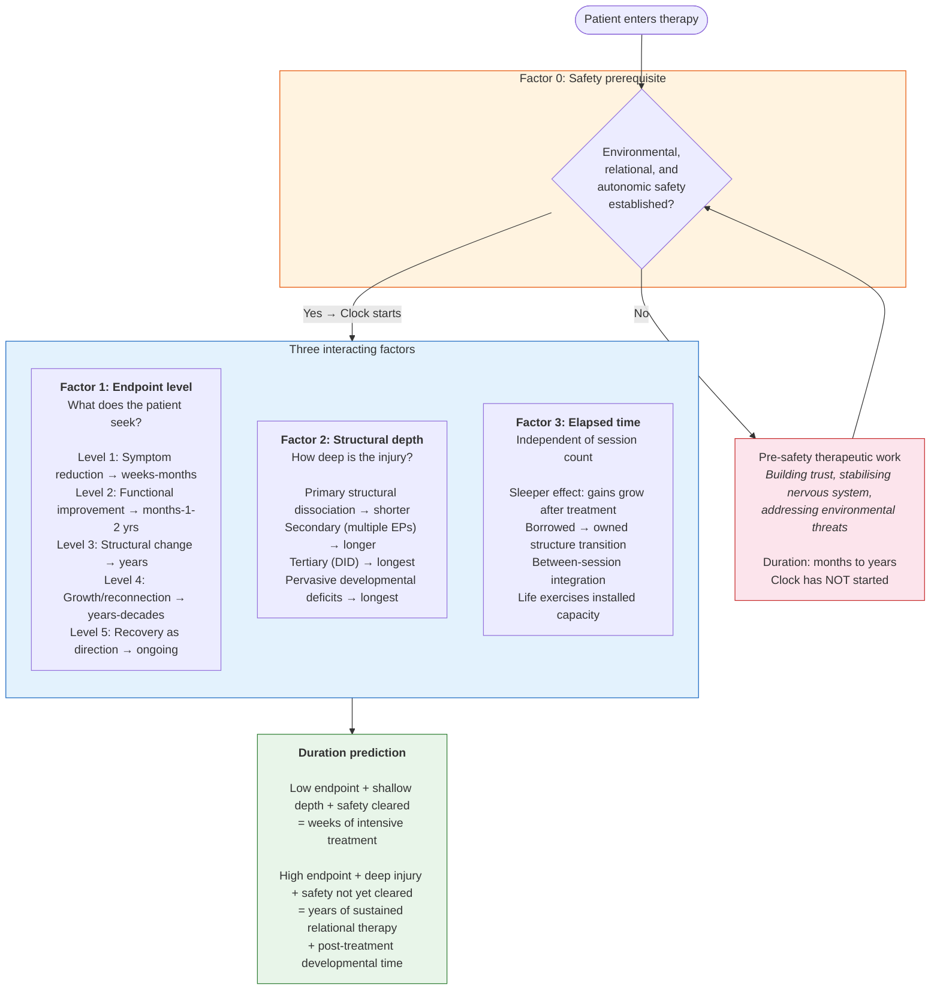

# Figure 2: The 4-factor framework

The review's synthesising argument proposes that the duration of healing from complex developmental trauma is determined by the interaction of a safety prerequisite with three factors. This diagram makes the framework's structure visible.

## Mermaid diagram

## Textual description (for accessibility)

The framework has two stages:

**Stage 1 — The gate.** Factor 0 (safety) operates as a prerequisite that must be cleared before the therapeutic clock starts. Environmental safety (not in active danger), relational safety (felt trust in the therapeutic relationship), and autonomic safety (nervous system out of chronic defensive mode) must all be sufficiently established. Pre-safety therapy time — which may span months or years for severely traumatised patients — is essential therapeutic work but does not count toward the healing process proper. All duration estimates in the literature that include pre-safety time are inflated.

**Stage 2 — The interaction.** Once safety is established, three factors interact to determine duration:
- **Factor 1 (endpoint level)** is the strongest single predictor. The relationship between endpoint level and duration is roughly exponential: weeks for symptoms, years for structure, decades for growth.
- **Factor 2 (structural depth)** modulates duration within each endpoint level. Patients with the same CPTSD diagnosis may differ fundamentally in structural disruption — from primary structural dissociation with preserved adaptive capacity to tertiary dissociation with pervasive developmental deficits.
- **Factor 3 (elapsed time)** contributes independently of therapeutic dose. The sleeper effect demonstrates that gains continue developing after treatment ends. Therapy installs capacity; life develops it. Beyond a sufficient dose threshold, additional sessions produce diminishing returns — the patient needs life-time, not more therapy-time.

**The poles.** At one extreme: a patient with shallow structural injury seeking symptom reduction who arrives with adequate safety → weeks of intensive treatment. At the other: a patient with deep structural disruption seeking personality integration who must first build safety from scratch → years of sustained relational therapy, with the expectation that gains will continue developing through subsequent life experience.

## Rendering notes

For professional rendering, consider:
- A vertical flowchart with the safety gate at top (warm colour — orange/amber)
- Three factor boxes below the gate (cool colour — blue), arranged side by side or stacked
- Duration prediction box at bottom (green — resolution)
- Pre-safety loop shown as a return arrow from the pink box back to the gate
- Clear visual distinction between the gate (binary: cleared or not) and the factors (continuous: each operates on a gradient)
- Two annotated example patients at the bottom showing how the factors combine for different predictions
